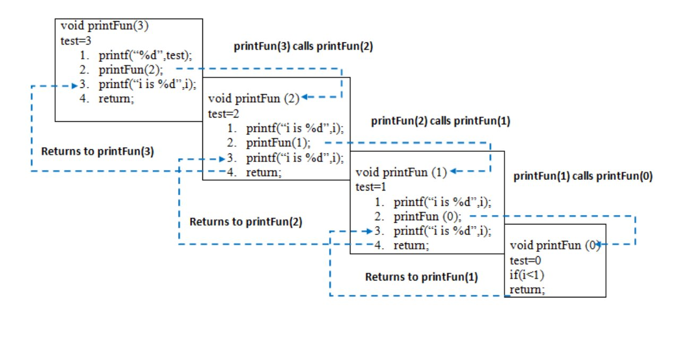

# Recursion

직/간접적으로 자신의 함수를 다시 호출하는 방식의 알고리즘

장점 : 코드를 작성하기 쉽다

단점 : recursive와 iterative program은 구조적으로 같은 방식이다. 모든 recursive 프로그램은 iteratively 작성 가능함. 그렇지만 Recursive는 훨씬 더 많은 space requirement를 요구하는 문제가 있음. 또한 call / return overhead로 인한 소요 시간도 

## Base Condition

더 큰 문제의 솔루션을 작은 문제로 나누는 형태이고, 이 때 가장 base case의 솔루션을 Base condtion이라 함

그런데, Stack Overflow에 주의해야함



# Tail recursion

기존의 recursion 같은 경우에는 자신의 입력 값, 리턴 값, 호출 후 돌아갈 장소 등을 Stack에 저장하게 되는데

반복 호출되는 함수 수에 따라 스택 오버플로우가 발생할 가능성이 있음

이를 해결하기 위해 현재 함수에서 재귀적으로 함수를 호출할 때, 기존의 함수로 돌아올 필요가 없게 하는 방식

즉, 컴파일러가 선형적으로 코드를 처리하도록 바꾸는 것

# Example

기존 재귀함수 호출 형태

```cpp
int Factorial(int n)
{

	if (n == 1) return 1;

	return n * Factorial(n-1);

}
```

이 코드는 컴파일러 입장에서 다음과 같이 해석됨

```cpp
int Factorial(int n)
{
	if (n == 1) return 1;

 	int result = Factorial(n - 1);
	return n * result;
}
```

이로 인해 Factorial(n-1)이 실행된 후 본 함수로 돌아와야하는 문제 발생

이를 방지하기 위해 tail recursion으로 구현한 방식 

```cpp
int FactorialTail(int n, int acc)    // acc : accumulator의 약자
{
	if (n == 1) return acc;
	return FactorialTail(n - 1, acc * n);    //  일반 재귀에서의 n * Factorial(n-1)와 달리 반환값에서 추가 연산을 필요로 하지 않음
}

int Factorial(int n)
{
	return FactorialTail(n, 1);
}
```

이는 컴파일러가 다음과 같이 해석하여 선형적으로 처리됨


```cpp
int FactorialTail(int n)
{
	int acc = 1;
	do
	{
		if (n == 1) return;
		acc = acc * n;
		n = n - 1;
	} while (true);
}
```
